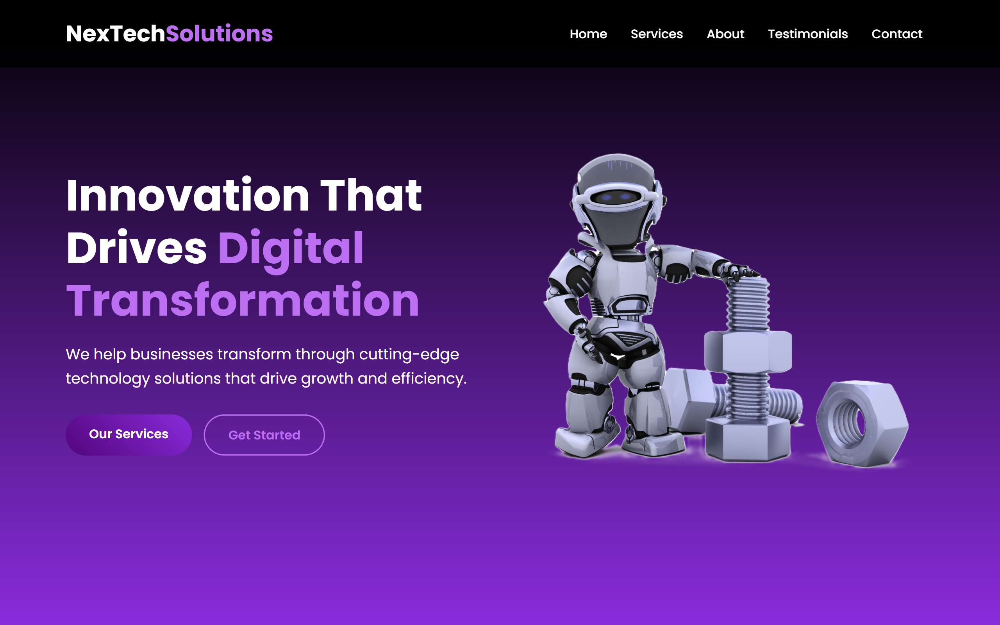

# NexTech Solutions Landing Page

> Modern, responsive landing page for a tech company built with HTML, CSS, and JavaScript



## 🚀 Live Demo

View the live demo: [NexTech Solutions Landing Page](https://nextechsolutions.netlify.app/)

## 📖 About the Project

This project is a modern landing page for a fictional tech company called "NexTech Solutions." It was designed to showcase fundamental web development skills and demonstrate how to create a responsive, visually appealing website using HTML, CSS, and vanilla JavaScript.

The landing page features a clean, professional design with a purple-themed color palette that creates a tech-focused feel. It includes multiple sections to highlight company services, showcase testimonials from satisfied clients, provide company information, and offer contact options.

The project was built as a beginner-friendly exercise to practice essential web development concepts including responsive design, CSS layout techniques, and basic JavaScript interactivity.

## 🎯 Features

- **Responsive Design** - Fully responsive layout that adapts to desktop, tablet, and mobile devices
- **Interactive Navigation** - Fixed header with smooth-scrolling navigation and mobile hamburger menu
- **Modern UI Elements** - Gradient backgrounds, cards, animations, and a cohesive color scheme
- **Testimonial Slider** - Automatic and manual carousel for client testimonials
- **Contact Form** - Functional contact form with basic validation
- **Newsletter Signup** - Form for newsletter subscription
- **CSS Animations** - Subtle animations to enhance user experience
- **Cross-Browser Compatible** - Works across modern web browsers

## 🛠️ Tech Stack

This project was created with:

- HTML5 - Semantic structure
- CSS3 - Styling and animations
- JavaScript - Interactive elements
- Font Awesome - Icons
- Google Fonts - Typography (Poppins)

No frameworks or libraries were used beyond Font Awesome for icons - the entire project is built with vanilla HTML, CSS, and JavaScript to demonstrate core web development skills.

## 📦 Installation

This is a static website with no build requirements. To get a local copy up and running, follow these simple steps:

1. Clone the repository

   ```sh
   git clone https://github.com/swayamDev/landing-page.git
   ```

2. Navigate to the project directory

   ```sh
   cd landing-page
   ```

3. Open the index.html file in your browser
   ```sh
   open index.html
   ```

## ▶️ Usage

This landing page template can be customized for various purposes:

- Company/Startup Website – Replace content with your company information
- Portfolio Showcase – Modify to highlight your projects and skills
- Product Landing Page – Adapt to feature a specific product
- Service Promotion – Customize to promote professional services

To customize:

1. Replace all placeholder text in `index.html` with your content
2. Update the color scheme in `styles.css` to match your brand
3. Replace placeholder images with your own
4. Modify the contact form to connect with your preferred form processing service

## 🤝 Contributing

Contributions are what make the open source community such an amazing place to learn, inspire, and create. Any contributions you make are **greatly appreciated**.

1. Fork the Project
2. Create your Feature Branch (`git checkout -b feature/AmazingFeature`)
3. Commit your Changes (`git commit -m 'Add some AmazingFeature'`)
4. Push to the Branch (`git push origin feature/AmazingFeature`)
5. Open a Pull Request

**Some ways you could contribute:**

- Improve accessibility features
- Add dark/light mode toggle
- Create additional page templates
- Enhance mobile responsiveness
- Optimize performance

## 📄 License

Distributed under the MIT License. See `LICENSE` for more information.

## 📬 Contact

**Your Name** – Swayam Swarup Panda – swayamcoder@gmail.com

Project Link: [https://github.com/swayamDev/landing-page](https://github.com/swayamDev/landing-page)

## 🎉 Acknowledgements

- [Font Awesome](https://fontawesome.com) – For the icon library
- [Google Fonts](https://fonts.google.com) – For the Poppins font family
- [ColorHunt](https://colorhunt.co) – For the color palette inspiration
- [Unsplash](https://unsplash.com) – For placeholder image inspiration

## 🔮 Future Work

- **Language Localization** – Add support for multiple languages
- **Dark Mode** – Implement light/dark theme toggle
- **Blog Section** – Add a blog component with article previews
- **Animation Enhancements** – More sophisticated animations using CSS and JS
- **Backend Integration** – Connect contact form to a backend service
- **Page Transitions** – Add smooth transitions between page sections
- **Accessibility Improvements** – Further enhance a11y compliance
- **Performance Optimization** – Implement lazy loading and other performance enhancements
